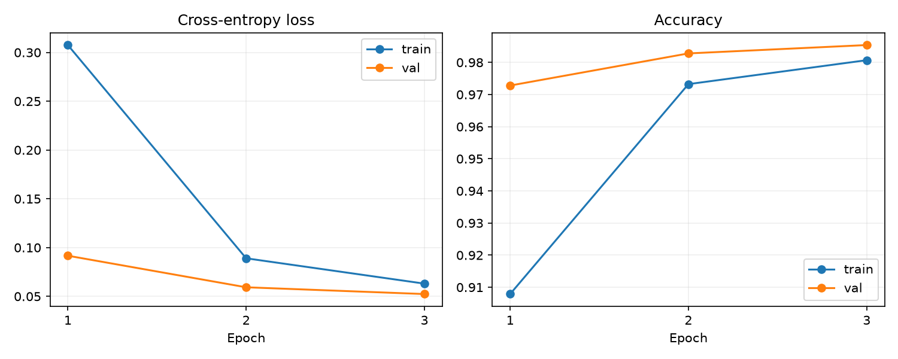
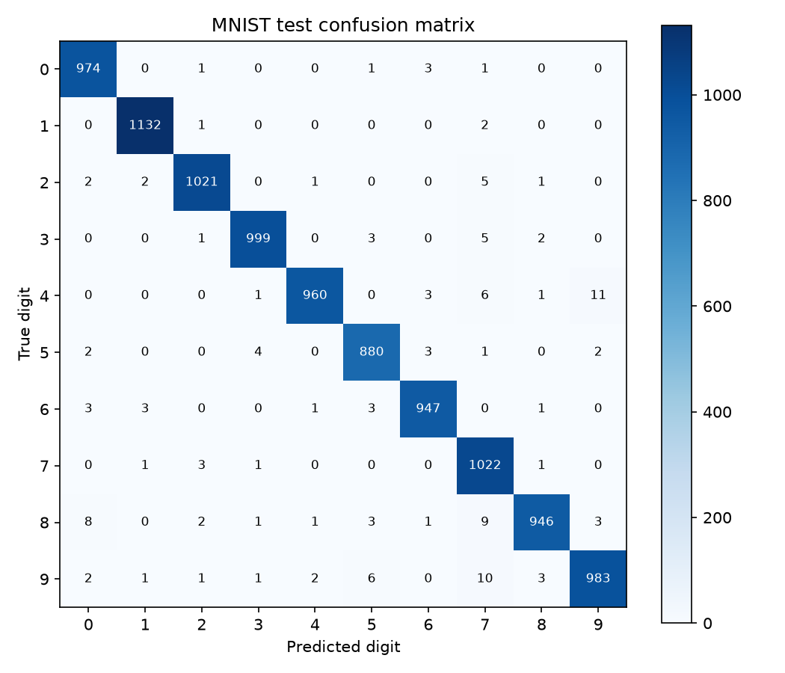
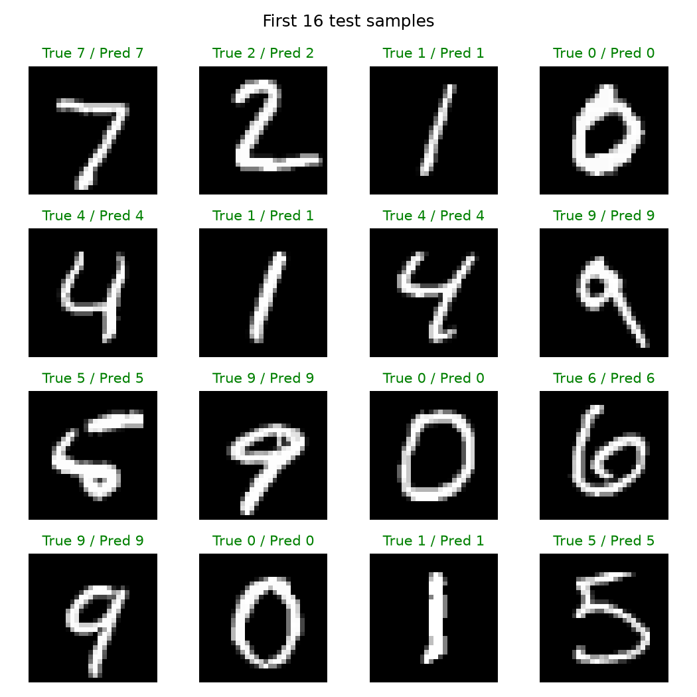
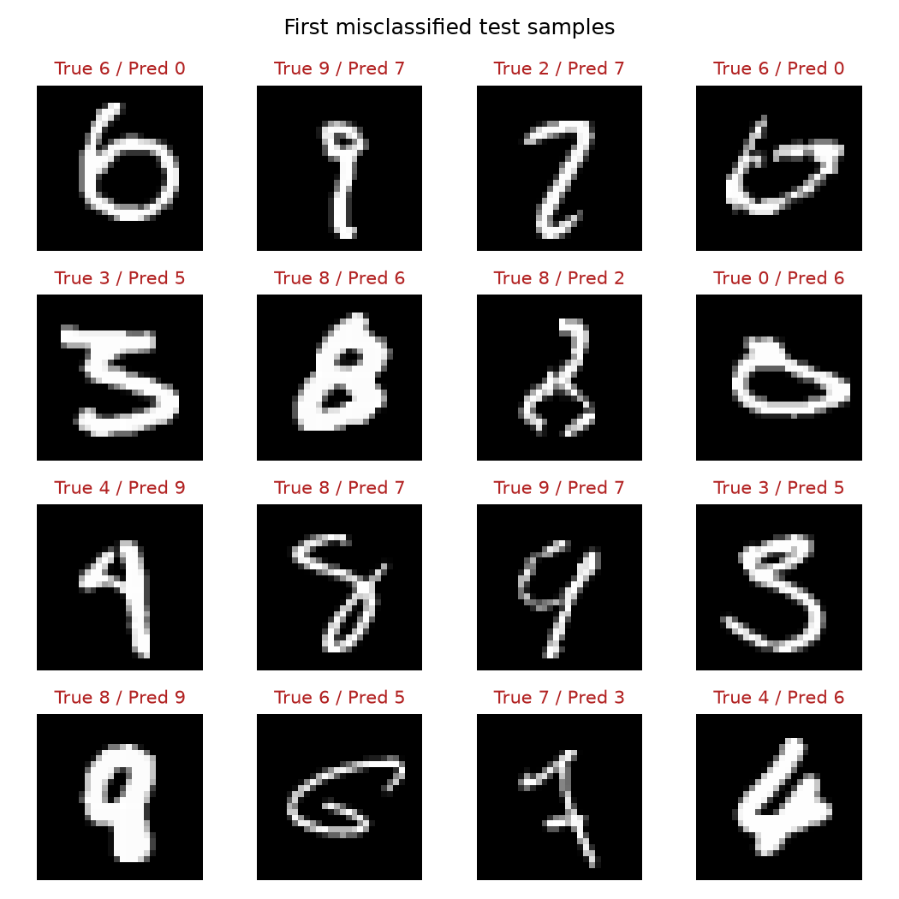

# PyTorch MNIST 手写数字识别

一个用于练习 Python 与 PyTorch 基本功的小型图像分类项目：实现卷积神经网络，完成数据加载、训练、验证、测试、模型保存与单张图片预测。

这是学习型基线项目，不以算法创新为目标。关注点是代码可读、实验可复现，以及对错误预测的分析。

## 模型与实验设计

```text
输入 [N, 1, 28, 28]
  → Conv(1→16, 3×3) → ReLU → MaxPool(2×2)
  → Conv(16→32, 3×3) → ReLU → MaxPool(2×2)
  → Flatten → Linear(1568→64) → ReLU → Dropout(0.2)
  → Linear(64→10) → 输出 logits
```

- 数据集：MNIST，共 10 个数字类别。
- 从官方 60,000 张训练图像中固定随机划分 55,000 张用于训练、5,000 张用于验证；官方 10,000 张测试图像只用于最终评估。
- 使用 `ToTensor` 和固定 MNIST 标准化常数（均值 0.1307、标准差 0.3081），训练与预测共用预处理。
- 使用 Adam、交叉熵损失，默认训练 3 轮，batch size 为 128，学习率为 0.001。
- 按验证集准确率保存最佳模型；准确率相同时保留较早的模型。最终加载最佳模型计算测试结果。
- 固定随机种子 42，记录环境和超参数；不同硬件、依赖版本仍可能出现数值差异。

## 快速运行

建议 Python 3.10 或更新版本。在项目根目录打开终端，以下命令适用于 Windows PowerShell：

```powershell
python -m venv .venv
.\.venv\Scripts\python.exe -m pip install -r requirements.txt
.\.venv\Scripts\python.exe train.py --epochs 3 --device cpu
.\.venv\Scripts\python.exe predict.py --index 0
.\.venv\Scripts\python.exe -m unittest discover -s tests -v
```

首次运行会自动下载 MNIST，需要联网。CPU 即可运行；如果已安装与显卡兼容的 CUDA 版本 PyTorch，可指定 `--device cuda`。在 PyCharm 中，将项目解释器设为 `.venv\Scripts\python.exe`，工作目录设为项目根目录。

预测自己的单个数字图片：

```powershell
# 黑底白字
.\.venv\Scripts\python.exe predict.py --image digit.png
# 白底黑字
.\.venv\Scripts\python.exe predict.py --image digit.png --invert
```

图片应只包含一个数字，尽量使用纯色背景、清晰笔画。脚本会转为灰度、裁剪非黑区域、保持比例缩放并居中到 28×28。拍照中的噪声、阴影和复杂背景不在本项目的处理范围内，MNIST 测试准确率不能代表真实拍照识别效果。输出的 softmax 分数不是经过校准的可信度。

## 实测结果

以下为本机实际运行的结果：Windows、Python 3.13.15、PyTorch 2.14.0+cu126、torchvision 0.29.0+cu126，使用 CPU 的 4 个计算线程。直接依赖版本见 `requirements-tested.txt`。本地 `.venv` 复用了已有的 PyTorch 环境，并单独安装绘图依赖；新机器可按上面的命令创建独立环境。

| 指标 | 实测值 |
| --- | ---: |
| 模型参数量 | 105,866 |
| 训练轮数 / 最佳轮次 | 3 / 3 |
| 最佳验证集准确率 | 98.54% |
| 测试集准确率 | **98.64%（9,864 / 10,000）** |
| 测试集交叉熵损失 | 0.04119 |
| 训练与逐轮验证耗时 | 43.36 秒 |

耗时不包含数据下载、最终测试和绘图。完整数值由 `train.py` 写入 `results/metrics.json`，逐轮指标保存在 `results/history.csv`。本次还通过了 3 项离线自动测试，并验证了 MNIST 样本预测和带 `--invert` 的图片文件预测。

测试集共错分 136 张，其中 `4 → 9` 为 11 张，`9 → 7` 为 10 张，`8 → 7` 为 9 张。这提示后续可研究笔画形态和倾斜变化，但不能仅凭此断言错误原因。三轮内验证损失持续下降；训练指标是在参数持续更新且 Dropout 开启时累计，验证指标则在每轮结束后关闭 Dropout 计算，因此二者不能当作完全相同条件下的直接对比。









示例图使用测试集最前面的 16 张图片；错误图使用最先遇到的最多 16 个错误样本，避免只挑选成功预测。

## 文件说明

| 文件 | 用途 |
| --- | --- |
| `model.py` | CNN 结构与前向传播 |
| `data_utils.py` | 共用标准化预处理 |
| `train.py` | 训练、验证、测试、保存模型、生成图表 |
| `predict.py` | 加载模型并预测测试样本或自定义图片 |
| `tests/test_pipeline.py` | 参数更新、模型读写、指标计算、图像处理测试 |
| `results/` | 可提交到 GitHub 的实测指标和图表 |
| `checkpoints/` | 本地生成的模型权重，已被 Git 忽略 |
| `data/` | 自动下载的数据集，已被 Git 忽略 |

每次训练会覆盖指定输出目录中的结果和指定检查点。比较实验时请分别指定输出路径，例如：

```powershell
.\.venv\Scripts\python.exe train.py --lr 0.0005 --output-dir results/lr_0005 --checkpoint checkpoints/lr_0005.pt
```

## 我需要能够解释的基本概念

1. `Dataset` 存储样本，`DataLoader` 负责分批和打乱；张量的四个维度分别表示什么？
2. 为什么交叉熵损失接收 logits，而不需要先调用 softmax？
3. `zero_grad → backward → step` 如何实现一次参数更新？
4. `model.train()`、`model.eval()` 与关闭梯度各自解决什么问题？
5. 为什么根据验证集选择模型，而不能根据测试集选择最佳轮次？
6. 哪些数字容易混淆，训练曲线是否显示过拟合？

下一步可以固定数据划分，对比全连接网络与 CNN，或改变 Dropout 和学习率。用验证集选择配置，再报告最终测试结果；多随机种子实验应报告均值和标准差。当前结果仅代表一次运行。

## 发布到 GitHub 并显示在主页

1. 在 GitHub 创建 Public 空仓库 `PytorchMnistClassifier`，不要初始化 README、License 或 `.gitignore`。
2. 检查待提交文件，避免提交数据集、虚拟环境、模型权重和 IDE 配置。
3. 首次提交并推送（已经提交过的步骤无需重复）：

```powershell
git add .gitignore README.md requirements.txt requirements-tested.txt model.py data_utils.py train.py predict.py tests results
git commit -m "Add reproducible PyTorch MNIST classification project"
git remote add origin https://github.com/hslLuna/PytorchMnistClassifier.git
git push -u origin HEAD
```

如果 `origin` 已存在，先用 `git remote -v` 检查，不要重复添加。推送时按 Git 的提示完成 GitHub 登录；无需将 token 写入代码。

4. 打开个人主页 → **Customize your pins** → 选中该仓库 → **Save pins**。主页会展示项目卡片，点击后即可查看代码、README 和实验图表。

## 参考资料

- [PyTorch 官方基础教程](https://docs.pytorch.org/tutorials/beginner/basics/quickstart_tutorial.html)：数据加载、训练循环与模型保存。
- [Torchvision MNIST 文档](https://docs.pytorch.org/vision/stable/generated/torchvision.datasets.MNIST.html)：本项目使用的数据集接口。
- [GitHub 官方置顶仓库说明](https://docs.github.com/en/account-and-profile/how-tos/profile-customization/pinning-items-to-your-profile)。
